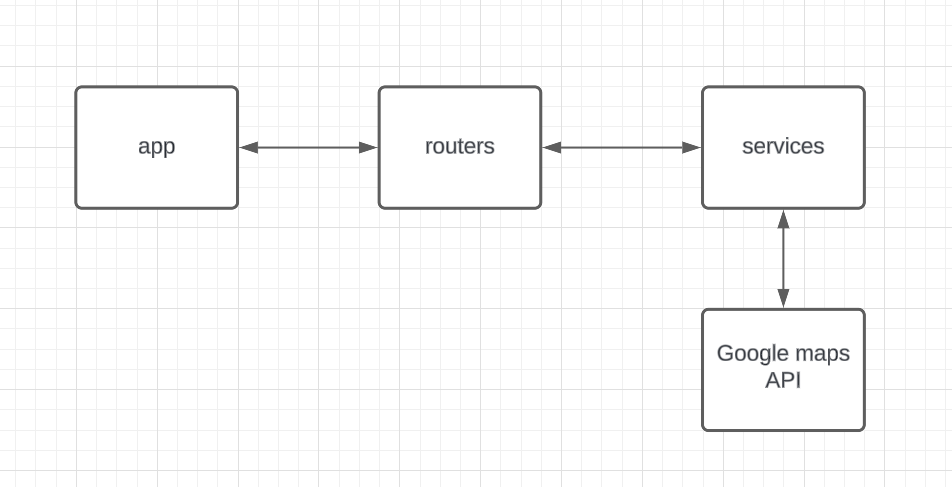

# Integração com o google maps

Para essa atividade foi realizado uma integração de uma api em fastapi com a api do google maps. O objetivo é que ao mandar a latitude e longitude de um local, a api retorne o endereço correspondente. Além disso, foi implementado uma funcionalidade extra para retornar locais próximos a um local específico.

## Componentes

